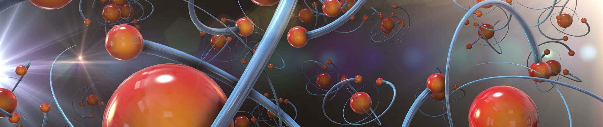

*****

*****

Quantum Chemistry Workshop
==========================

Quantum Chemistry with Python - Developing Own Scientific Ideas

# Table of Contents:
 * [Psithon: Python and Psi4 Combined](https://github.com/globulion/qc-workshop/tree/master/tutor/README.md)
 * [Project I: Population Analyses](https://github.com/globulion/qc-workshop/tree/master/tutor/README-i.md)
 * [Project II: Configuration Interaction with Singles](https://github.com/globulion/qc-workshop/tree/master/tutor/README-ii.md)
 * [Project III: Trajectory Surface Hopping Dynamics](https://github.com/globulion/qc-workshop/tree/master/tutor/README-iii.md)

