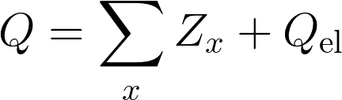
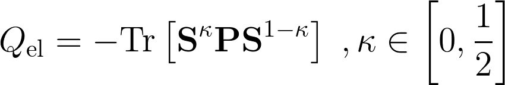
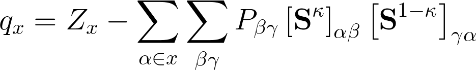

# Population analyses

Population analyses are useful tools for investigating charge distribution
within molecular systems. 

## Molecular total charge

The total charge of a molecule is a sum of atomic and electronic charge

where the total electronic charge
can be expressed in terms of the
bond order matrix **P** according to

Note that the parameter kappa is arbitrary within the limits imposed.

## Atomic charge population analysis

The atomic charge can be defined as

Therefore, it is clear that there exist infinite ways to obtain
a set of partial atomic charges.

## Localized orbital population analysis

Another partitioning scheme
