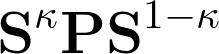

# Population analyses

Population analyses are useful tools for investigating charge distribution
within molecular systems. In this Project we will implement some examples.

## Molecular total charge

The total charge of a molecule is a sum of atomic and electronic charge


where the total electronic charge
can be expressed in terms of the
bond order matrix **P** according to


Note that the parameter kappa is arbitrary within the limits imposed.

## Atomic charge population analysis

The atomic charge can be defined as


Therefore, it is clear that there exist infinite ways to obtain
a set of partial atomic charges. To implement the above equation, we need
to compute the alpha and beta one-particle density matrices, as well as
the overlap matrix **S** in AO basis. If we have `psi4.core.Wavefunction` object
already created (e.g. by using `psi4.energy` driver),
this can be done simply by

```python
# bond-order matrix
P = wfn.Da().clone()
P.add(wfn.Db())

# overlap matrix
S = wfn.S()
```

Note that we need to construct a copy of alpha density matrix because `wfn.Da()` will return 
a reference to `psi4.core.Matrix` object.

Next step is to compute the product 
, and then to partition the diagonal
elements according to the groups that are associated with particular atom.
The first step requires computing the power of a matrix which is given by

## Localized orbital population analysis

Another partitioning scheme
