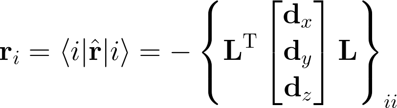

# Population analyses

Population analyses are useful tools for investigating charge distribution
within molecular systems. In this Project we will implement some examples.

## Molecular total charge

The total charge of a molecule is a sum of atomic and electronic charge


where the total electronic charge
can be expressed in terms of the
bond order matrix **P** according to


Note that the parameter kappa is arbitrary within the limits imposed.

## Atomic charge population analysis

The atomic charge can be defined as


Therefore, it is clear that there exist infinite ways to obtain
a set of partial atomic charges. To implement the above equation, we need
to compute the alpha and beta one-particle density matrices, as well as
the overlap matrix **S** in AO basis. If we have `psi4.core.Wavefunction` object
already created (e.g. by using `psi4.energy` driver),
this can be done simply by

```python
# bond-order matrix
P = wfn.Da().clone()
P.add(wfn.Db())

# overlap matrix
S = wfn.S()
```

Note that we need to construct a copy of alpha density matrix because `wfn.Da()` will return 
a reference to `psi4.core.Matrix` object.

Next step is to compute the product 
, and then to partition the diagonal
elements according to the groups that are associated with particular atom.
The first step requires computing the power of a matrix which can be computed from
the expression for a *matrix function* according to


where **a** is the diagonal matrix of eigenvalues of **A** whereas **U** is the eigenvector matrix
with each column corresponding to a particular eigenvalue. The matrix function of a diagonal
matrix is simply a function of its diagonal elements, i.e.,


Note that in our case, a matrix function is taking it to a power of kappa (or 1-kappa, respectively).

The last step is to extract the information about the basis set function atomic centres.
This can be achieved by using `psi4.core.BasisSet.function_to_center` option, which returns the atomic id
from the basis function id:

```python
# grab molecule and AO basis set objects
mol = wfn.molecule()
bsf = wfn.basisset()

# initialize charges
q = numpy.array([mol.Z(x) for x in range(mol.natom())], numpy.float64)

# add the electronic contribution
Sk = matrix_power(S, kappa)
Sk1= matrix_power(S, 1.0 - kappa)
G = numpy.linalg.multi_dot([Sk, P, Sk1])
# 
for i in range(bfs.nbf()):
    x = bfs.function_to_center(i)
    q[x] -= G[i,i]
```

Here we assumed that `matrix_power` function returns the power of a matrix. Note that
such a function can be easily written in terms of NumPy. It can also be accessed directly
through SciPy module.

## Localized orbital population analysis

Another partitioning scheme that we will explore is the orbital localization.
Two most popular methods are 
  - Boys
  - Pipek-Mezey

The above methods search for a unitary transformation matrix **U** that
localizes given molecular orbitals **C** in terms of a certain criterion.
The localized orbitals **L** are linear combination of old orbitals, i.e.,


Note that in the case of the single reference wavefunction 
the electronic charge on each of such (occupied) orbitals will be equal -1.
One can easily compute the charge centroids of such orbitals from
the dipole integrals **d** in AO basis,




