# The Hartree-Fock Model

The usual starting point in the description of the electronic ground state
of molecules is through the Hartree-Fock (HF), or molecular orbital, approximation.
Here we consider HF theory for the closed shell case,
where the total energy of the molecule is given by

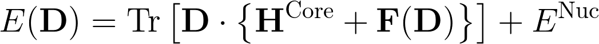

where the nuclear repulsion energy is

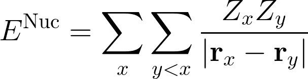

and the effective one-electron Fock matrix **F** is defined according to

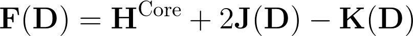

**D**, the one-particle density matrix,

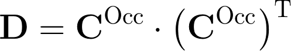

is build up from the occupied molecular orbital's block of the molecular orbitals LCAO-MO matrix
**C**, given by the generalized eigenvalue problem

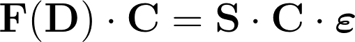

Note that the Core Hamiltonian **H**core is independent of the density matrix,

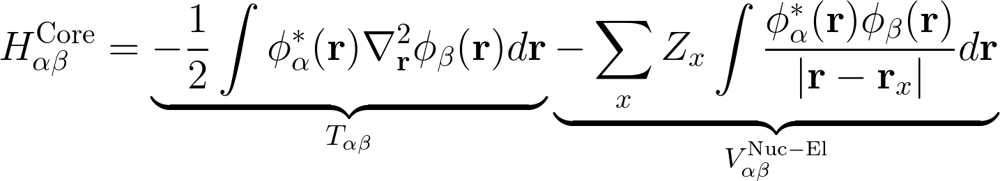

whereas the Coulomb and exchange integrals need to be computed from it
by contracting it with the two-electron integrals, i.e.,

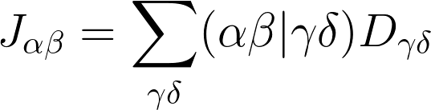
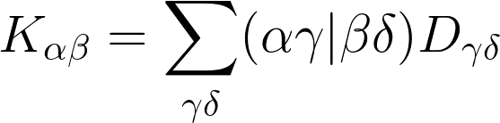

It is often more convenient to solve the SCF equations in the orthogonal AO basis set.
In such a case, **S** is just an identity matrix. Alternatively, one can solve the generalized
eigenvalue problem directly in the non-orthogonal AO basis. Here, we choose the first option,
where the Fock matrix is transformed to the orthogonal AO basis, diagonalized, and the resulting 
MO's back-transformed to the original (non-orthogonal) AO basis.


# Implementation

The algorithm can be sketched in the following steps:
  1. Choose guess for the Fock matrix. 
  2. Compute the orthogonalizer and core Hamiltonian
  3. Transform guess Fock matrix to orthogonal AO basis
  4. Diagonalize to obtain orbital energies and MO's
  5. Back-transform orbitals to the original basis
  6. Compute density matrix in original basis
  7. SCF cycle: Compute new Fock matrix in original basis
  8. SCF cycle: Compute current energy
  9. SCF cycle: Transform new Fock matrix to orthogonal basis
  10. SCF cycle: Diagonalize new Fock matrix to obtain new orbital energies and MO's
  11. SCF cycle: Back-transform new orbitals to the original basis
  12. SCF cycle: Compute density matrix in original basis
  13. Iterate between Points 7-12 until convergence

Below, we analyze each of the above steps in detail.

## 1. Choose guess for the Fock matrix

One of the simplest to implement is just core Hamiltonian (density matrix is zero).

## 2. Compute the orthogonalizer and core Hamiltonian

The orthogonalizer can be computed according to the Lowdin method,
in which 

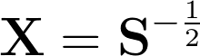

where **S** is the overlap matrix between AO's. Core Hamiltonian can be built
very easily using the MintsHelper object:
```python
mints = psi4.core.MintsHelper(bfs)
T = mints.ao_kinetic() # kinetic integrals
V = mints.ao_potential() # sum of potential electron-nucleus integrals over all nuclei
H_core = T.to_array() + V.to_array()
```

## 3. Transform guess Fock matrix to orthogonal AO basis

The transformation can be easily achieved just by evaluating

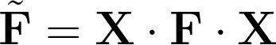

## 4. Diagonalize to obtain orbital energies and MO's

That is, compute eigenvalues and eigenvectors of the Fock matrix in orthogonal AO space
according to

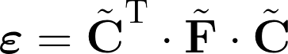

## 5. Back-transform orbitals to the original basis

Since Fock matrix is now in orthogonal AO space, we need to back transform it
to original space according to

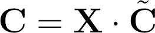

## 6. Compute density matrix in original basis

Just perform the inner product of the occupied orbital LCAO-MO matrices
as given above in the introduction, i.e.,
```python
D = numpy.dot(Co, Co.T)
```

## 7. SCF cycle: Compute new Fock matrix in original basis

Compute the Coulomb and exchange matrices. It can be easily performed by using the JK object.
Then use the equation given in the introduction to compute the Fock matrix from the
```python
jk.C_clear()
jk.C_left_add(Co)
jk.compute()
J = jk.J()[0]
K = jk.K()[0]
F = H_core + 2.0 * J.to_array() - K.to_array()
```
Pay attention to the types of data here. Note that `J` and `K` objects are returned as `psi4.core.Matrix` objects,
not `numpy.ndarray` objects. Note also, that we do not set the right **C** matrix: in this case the right matrix is assumed to be identical to the left **C** matrix.

To improve convergence, Fock matrix can be 'smoothen' by applying the so called damping algorithm.
It is just a linear interpolation between previous and current Fock matrix, with one scalar parameter in the integval between
0 and 1: 

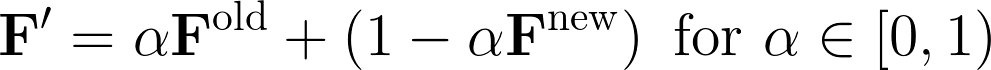

In the above, the value of 0 for the damping parameter 
corresponds to no damping (new guess for Fock is entirely taken from the update), 1 corresponds to no change.

## 8. SCF cycle: Compute current energy

Compute current energy from the equation given in the introduction, i.e.,
```python
 E = numpy.trace( numpy.dot(D, H_core + F) ) + molecule.nuclear_repulsion_energy()
```
Note that we can easily compute nuclear repulsion energy with the `psi4.core.Molecule` object.

## 9. SCF cycle: Transform new Fock matrix to orthogonal basis

As above for the guess Fock matrix, transform the newly computed Fock matrix to the orthogonal AO basis,
```python
F = numpy.dot(X, numpy.dot(F, X))
```

## 10. SCF cycle: Diagonalize new Fock matrix to obtain new orbital energies and MO's

As above for the guess,
```python
eps, C = numpy.linalg.eigh(F)
```

## 11. SCF cycle: Back-transform new orbitals to the original basis

As above,
```python
C = numpy.dot(self.X, C)
```
> Pay attention wether the orbitals are sorted according to the orbitals energies or not.
> This can make implementation easier.
 
## 12. SCF cycle: Compute density matrix in original basis

From the occupied orbitals form the density matrix. If the orbitals are sorted in ascending order
according to their energy, the occupied orbitals
can be easily extracted from the **C** matrix by
```python
Co - C[:,:ndocc]
```
where `ndocc` is the number of doubly occupied MO's (since we consider a closed shell here).

> *Excercise*: Implement the unrestricted HF method (UHF) method
> by extending the above RHF code.

-----------

[Main Page](https://github.com/globulion/qc-workshop#quantum-chemistry-workshop)
