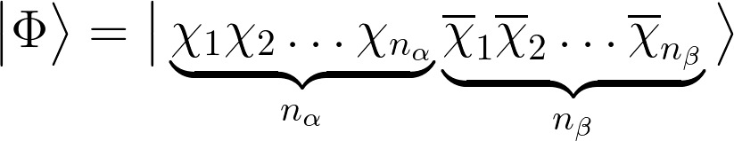

# Configuration Interaction Singles

One of the easiest ways to model electronic excited states is through
the configuration interaction singles (CIS) method. 
In this method, the electronic wavefunction of a molecule
is assumed to be given by

where the first term is the Hartree-Fock (reference) Slater determinant
composed of the HF occupied molecular orbitals,
whereas the latter terms constitute of the Slater determinants
in which one occupied MO was replaced with one virtual MO, weighted by
CIS coefficients *c*. In general, any Slater determinant can be
fully described by the set of alpha and beta spin-orbitals

which are to be arranged in a form of a determinant
so that all the permutations of electron labels are exhausted,
and are therefore by construct antisymmetric with respect to interchange
of electron labels:

Effective Hamiltonian can be constructed in the basis of all these
Slater determinants. The form before integrating out the spin coordinates
is as follows:

where the Fock matrix elements are given by

In the above equation, *h* is the one-electron core Hamiltonian
operator

composed of the electronic kinetic energy operator *T* and
electron-nucleus interaction energy operator *V* (the summation over *u* runs through
all nuclei in the molecule).

Note that we need to explicitly care about electron spins when evaluating
Hamiltonian matrix elements in the Slater determinant basis.
The CIS Hamiltonian can be drawn like this:

The first diagonal block is just one number, equal to the reference (ground state) electronic
energy, obtained by solving the Hartree-Fock problem. The offdiagonal blocks
in white are zero due to de Bruillouin theorem. The next diagonal blocks (blue)
correspond to the excitations of electron of the same spin in bra's and ket's,
and they are given by

and analogously for the beta spin.
The offdiagonal blocks (green) are given by

and analogously for the twin term. In the above working equations,
two-electron integrals in MO basis were represented in the Coulomb (or chemist's)
notation which is given by

