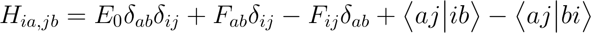

# Configuration Interaction Singles

One of the easiest ways to model electronic excited states is through
the configuration interaction singles (CIS) method. 
In this method, the electronic wavefunction of a molecule
is assumed to be given by

Effective Hamiltonian can be constructed in the basis of all these
Slater determinants. The form before integrating out the spin coordinates
is as follows:

where the Fock matrix elements are given by

In the above equation, *h* is the one-electron core Hamiltonian
operator

composed of the electronic kinetic energy operator *T* and
electron-nucleus interaction energy operator *V* (the summation over *u* runs through
all nuclei in the molecule).

Note that we need to explicitly care about electron spins when evaluating
Hamiltonian matrix elements in the Slater determinant basis.
The CIS Hamiltonian can be drawn like this:

The first diagonal block is just one number, equal to the reference (ground state) electronic
energy, obtained by solving the Hartree-Fock problem. The offdiagonal blocks
in white are zero due to de Bruillouin theorem. The next diagonal blocks
correspond to the excitations of electron of the same spin in bra's and ket's,
and they are given by

and analogously for the beta spin.
