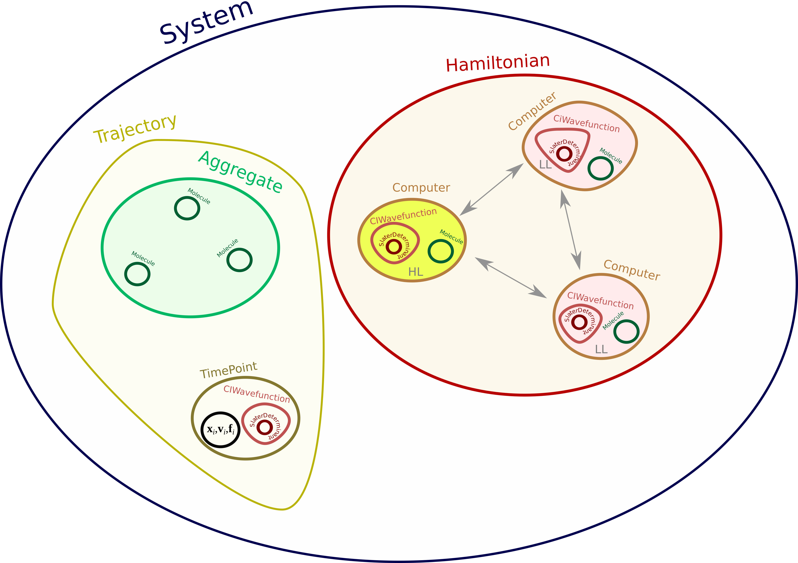

# Molerucal Dynamics

## Newtonian Molecular Dynamics

## Quantum Dynamics

## Trajectory Surface Hopping

## Algorithm

# Programming Task

Our task is to write an application that performs the TSH dynamics for a
molecular aggregate with one molecule being described by the high level
quantum mechanical method allowing for computing electronic excited states
(such as CIS, TDDFT, EOM-CC, CASSCF, ADC etc.), an the rest by a low level
ground state method (either HF, MP2, CC or just molecular mechanics). We wish to
be able to choose between various embedding schemes (electronic embedding due to constant
or variable atomic charges, electronic density, polarizable density embedding and so on).
Therefore, the code has to provide a unified and flexible framework and platform 
for extending its functionalities without disturbing the core idea and structure of the application.
It should also allow to specify the interface between third-party Quantum Chemistry software
if necessary.

## Specification of Objects and Their Relationships

The most convenient way to start is to establish the structure of the project: data types, 
objects and relationships between them. Since our task is to model the molecular dynamics, our target object
will be a *dynamical system*. The schematic representation of such a system for the need of TSH algorithm
is shown below:

The circles represent certain classes of objects understood as basic abstract building blocks
of our program.
It is important to distinguish here between the abstract classes and the actual utility classes
which will be later on used to instantiate the objects. 

The six major abstract base classes were identified:
 1. **Aggregate** - this class describes the entire molecular system. It
    contains information about the molecular composition of the aggregate, its 
    coordinates, charge and multiplicity division
    into fragments, as well as which molecule is in excited state allowed region.
 2. We probably want the instances of class Aggregate to store objects of type **Molecule**, 
    referring to particular molecules from the aggregate (such as `psi4.core.Molecule` class).
 3. **Hamiltonian** - is to describe the quantum Hamiltonian of an entire aggregate.
    That is to say, here the environmental effects on each molecular wavefunction
    are to be implemented. Object of this class will therefore be responsible for
    solving Schrodinger equation for each fragment in the presence of other fragment,
    resulting in an effective electronic Hamiltonian of an entire system.
    We probably want to refer inside its instance to Aggregate as a reference.
 4. Each Molecule object will be handled by a separate **Computer** object, that stores
    the actual information about the molecule and its wavefunction. Computer therefore can be viewed
    as sort of interface between the TSH application and certain 
    method of solving the Schrodinger equation, implemented elsewhere.
 5. Computer instances will store the information of the multireference wavefunction
    of a given fragment in instances of type **CIWavefunction**. This class
    describes the composition of an arbitrary set of electronic states in terms of Slater determinants
    as basis functions.
 6. **Trajectory** object will manage phase space elements in time. It should store 
    nuclear positions, velocities and forces, as well as copies of
    CIWavefunction objects at a given time.
    
    
## Implementation
