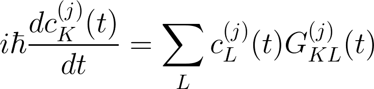
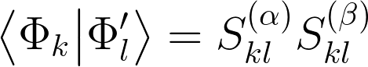

# Trajectory Surface Hopping

One of efficient and practical ways to approximately 
propagate a molecule in electronically excited state
is to perform the trajectory surface hopping (TSH) dynamics.
In this approximation, a model mixed classical/quantum system
is defined as an ensemble of trajectories in which:
 1. Nuclear degrees of freedom obey Newtonian dynamics
    based on a current electronic potential energy surface (PES)
    by solving the Newton's equations of motion
 2. Electronic defrees of freedom are treated quantum mechanically
    by solving the time-dependent Schrodinger equation of motion

The electronic wavefunction at any given time *t* for 
a *j*th trajectory can be given in terms of
the adiabatic states


that are eigenfunctions of the
electronic Hamiltonian at time *t*, i.e.,


The total electronic wavefunction obeys the time-dependent Schrodinger equation


Let us assume that for a given *j*th trajectory, system
is in the *K*th electronic adiabatic state associated with the 
potential energy surface (PES)


Then, the quasi-classical forces on atoms can be defined by


where *u* labels a particular atom. Note that here **f** can be considered
as a matrix of shape (natoms, 3). Note that the quasi-classical potential
energy function comprises of the sum of electronic kinetic energy,
electronic potential energy due to electrons and nuclei, as well as potential
energy due to nuclear repulsion.

Owing to the equation for the time evolution of the electronic wavefunction,
the quantum amplitudes *c(t)* evolve according to a set of coupled partial
differential equations of the form



where the coupling (hermitian) matrix is given by


with **v** being the velocities of each atom. 
In the above equation, **d** denotes the nonadiabatic coupling vectors


The task is, in each trajectory,
to classically propagate the system
by integrating the Newton's equations of motion,
solve the quantum amplitude equations and
determine if the quantum transition to another state
is probable and should be carried out (hop) based
on certain criterion. If hop occurs for a given trajectory,
then momenta must be altered in some way to conserve the total energy.

In general, TSH algorithm assumes that all trajectories 
are independent from each other. However, it leats to unphysical
results. This can be understood by imagining more accurate and rigorous approach,
in which electrons and nuclei are treated fully quantum mechanically.
Then, states are better described by quantum wavepackets.
Wavepackets, that are
evolving on different PES will eventually decouple from each other
in a multiatomic system. However, in TSH method we force all the adiabatic
states to follow a current PES which will lead to unphysical coherences
between states after long time, even after performing a hop. In effect,
the quantum amplitudes *c(t)* tend to drag still on state *K* even after a hop to
a new PES *M*. This 'decoherence problem' has to be addressed as well.
In effect, few methods allowed TSH algorithm to retain effective independence
of each trajectory provided certain decoherence scheme is applied to amend TSH algorithm.

## 1. Algorithm

Since TSH is a stochastic method, we need to run multiple trajectories
in order to get averages. Provided each trajectory can be run effectively
independently, the algorithm constitutes of these steps:
 1. Set up initial conditions. 
 2. Compute wavefunction, coupling matrix and forces on atoms assuming initial PES.
 3. Compute new positions from velocity Verlet method
 4. Compute new wavefunction and coupling matrix for newly computed positions
 5. Compute new quantum amplitudes *c(t)*
 6. Hop to different PES if required. Compute new forces assuming the current PES
 7. Compute new atomic velocities from new forces using velocity Verlet. 
 8. Proceed to next time step (point 3).


### 1.1 Initial conditions

One can start all trajectories from the same or different initial condition.
Nuclear initial conditions (velocities, positions of atoms) 
should be carefully prepared based on thermodynamic ensemble of state in question
(eiger sampled from classical distribution or quantum Wigner distribution
for normal mode sampling). Electronic initial conditions can be applied by simply
setting quantum amplitude of the initial electronic state to 1, and the rest to 0.

### 1.2 Compute wavefunction, forces and coupling matrices

For a given nuclear configuration, solve the time-independent Schrodinger
equation and obtain the multiconfigurational states
as well as their electronic energies. Compute derivatives of *total energy* with respect to the nuclear coordinates
(either analytically, if available, or numerically) assuming the initial electronic state PES.
If forces are not available analytically by any program and their implementation is
tedious, you can resort to numerical evaluation. The least expensive way is to use
the forward 2-point finite difference method, i.e.,


It requires 3*N* additional evaluations of total energy
where *N* is the number of atoms.

After forces are computed, we can compute coupling matrix that is necessary for quantum propagation
of amplitudes and evaluation of probability of hopping to another state.
Real part
of a coupling matrix **G** is just a diagonal matrix composed of eigenvalues of electronic Hamiltonian.
The imaginary part of **G** is equal to the product **v·d**, which
can be evaluated from finite differences as


In most of TSH algorithms, elements of **d** vector are also needed for momentum adjustment
after a hop is performed in the system. However, for that moment, these vectors are not necessary.

To compute the **v·d** product, we need to compute the overlap integrals between the two
different adiabatic states at different times. In general, the overlap integral
between two adiabatic states is given by


where **U** and **U**' are the sets of the CI vectors in the basis of Slater determinants
for first and second adiabatic state. Note that the basis is different for both states
because the molecular orbitals are different at different times (the prime indicates that fact).
Therefore, we must compute overlap integrals between two different Slater determinants
having different sets of molecular orbitals. This can be relatively easily computed by 



where the alpha and beta intermediate matrices are given by


and 


Note that we need to assemble determinants of overlap matrices between molecular 
orbitals of the same kind (either alpha or beta). Overlaps between MO's are
given by SCF-LCAO-MO transformation matrices as follows


and analogously for the beta spin.

### 1.3 Compute new atomic positions

Subsequent atomic positions can be computed from velocity Verlet method
by


### 1.4 Compute new wavefunction for newly computed positions

Solve time-independent Schrodinger equation for updated atomic positions, 
new adiabatic states, energies
and coupling matrix as we did above.

### 1.5 Propagate quantum amplitudes

We assume for a moment that in a small time step coupling matrix
is approximately constant. Therefore, the system of coupled differential equations
for *c(t)* has the formal solution of the form


Therefore, one must find eigenvalues and eigenvectors of a complex coupling
matrix in order to evaluate quantum amplitudes.

> *Homework*:
> In more accurate simulations, one must include time-dependence of the coupling matrix
> to some extent. The easiest way to do it is to use linear interpolation and extrapolation
> to compute coupling matrix elements at intermediate time points within the classical time step.
> Once it is done, quantum amplitudes can be found by numerically integrating set of coupled differential
> equations, for example, by using the Runge-Kutta method. Use time step 1000 smaller than 
> the classical time step to solve the quantum amplitudes with such a linear time-dependence of the coupling matrix.


### 1.6 Hop to different PES if required.

First, compute transition probabilities from current state to all other states.
For this, we use the fewest switches algorithm of Tully,
in which the probability from state *K* to *L* is given by


Next, determine whether to hop or not. This is usually realized by
generating a pseudo-random number *z* from the range [0,1].
The transition to state *M* occurs if


If the above condition is satisfied,
compute the **d** vectors (see below). From them and the current velocities
estimate the quantity


where


Hop can occur only if .
If this is not the case, just continue without changes in the current state index.
Otherwise, hop occurs to state *M*. Switch PES to the new state *M*.

shift momenta to conserve total energy
in the following way:


### 1.7 Compute new atomic atomic forces and velocities

Since the new electronic state has been determined by checking if hop occurs or not,
we can compute new forces on a current PES. From them, we update
velocities by using the velocity Verlet scheme:


However, if hop just had occured, 
we need to adjust the velocities


where the auxiliary constant is given by


### 1.8 Go to next classical time step

Having updated positions, velocities, forces and quantum amplitudes, as well
as determining which electronic state is currently occupied, 
proceed to next time step and continue the dynamics.


# Programming Task

Our task is to write an application that performs the TSH dynamics for a
molecular aggregate. We require one molecule to be described by the high level
quantum mechanical method that allows to compute electronic excited states
(such as CIS, TDDFT, EOM-CC, CASSCF, ADC etc.), and the rest of the system by a low level
ground state method (either HF, MP2, CC or just molecular mechanics). We wish to
be able to choose between various embedding schemes (electronic embedding due to constant
or variable atomic charges, electronic density, polarizable density embedding and so on).
Therefore, the code has to provide a unified and flexible framework and platform 
for extending its functionalities without disturbing the core idea and structure of the application.
It should also allow to specify the interface between third-party Quantum Chemistry software
if necessary.

## Specification of Objects and Their Relationships

The development of a good object oriented code planning is crucial for efficient and
pleasant implementation. Ideally, the more code structure resembles
the actual structure of the problem, the better. For example, we would think of a class
*Molecule* storing information about molecular fragment as our Born-Oppenheimer model
with points and sticks representing atoms and connectivity, because we imagine molecules
this way most of the time. However, we probably would not expect Molecule to be able to
compute electronic wavefunction (because its simply beyond its scope). However, another class
(e.g., named *Computer*) could be in charge of solving the Schrodinger equation to obtain
electronic wavefunction for a given nuclear configuration. Then, objects of class Computer
would contain attributes of type Molecule. Clearly, opposite relationship is not logical
(we do not expect Molecule instances to store Computer instance).

Therefore, before starting programming, the most convenient and economical 
way to start is to establish the structure of the entire project: **data types, 
objects and relationships between them**. Since our task is to model the molecular dynamics, our target object
will be a *dynamical system*. The exemplary representation of such a system for the need of TSH algorithm
is shown below:


The circles represent certain classes of objects understood as basic abstract building blocks
of our program.
It is important to distinguish here between the base (maybe even abstract) classes and the actual utility classes
which will be used to instantiate the objects later on. 
The eight major base classes were identified:

 1. **Aggregate** - this class describes the entire molecular system. It
    contains information about the molecular composition of the aggregate, its 
    coordinates, charge and multiplicity division
    into fragments, as well as which molecule can be in excited state.
 2. We want the instances of class Aggregate to store objects of type **Molecule**, 
    referring to particular molecules from the aggregate. In Psi4, such class is already
    available (`psi4.core.Molecule` class).
 3. **Hamiltonian** - is to describe the quantum Hamiltonian of an entire aggregate.
    That is to say, here the environmental effects on each molecular wavefunction
    are to be implemented. Object of this class will therefore be responsible for
    solving Schrodinger equation for each fragment in the presence of other fragment,
    resulting in an effective electronic Hamiltonian of an entire system.
    We probably want to refer inside its instance to Aggregate as a reference.
 4. Each Molecule object will be handled by a separate **Computer** object, that stores
    the actual information about the molecule and its wavefunction. Computer therefore can be viewed
    as sort of interface between the TSH application and certain 
    method of solving the Schrodinger equation, implemented elsewhere. Computers will be in contact with
    each other through Hamiltonian object.
 5. Computer instances will store the information of the multireference wavefunction
    of a given fragment in instances of type **CIWavefunction**. This class
    describes the composition of an arbitrary set of electronic states in terms of Slater determinants
    as basis functions.
 6. Therefore, a **SlaterDeterminant** class would be very helpful to handle the information
    on each basis function from the multireference wavefunction. SlaterDeterminant will 
    store information of the composition of each determinant (orbitals), the source orbitals
    from the reference determinant (occupied and virtual orbitals), as well as the rule
    of creating determinant from a reference.
 7. **TimePoint** object will manage phase space elements in time. It should store 
    nuclear positions, velocities and forces, as well as copies of
    CIWavefunction objects at a given time.
 8. **Trajectory** will collect timepoints in an ordered sequence. It will provide an interface
    to modify the trajectory (e.g., rescale momenta to conserve energy).
    
    
## Implementation

Let us start from the bottom of the project: 
implement the classes of the smallest range from the above scheme
(Molecule, Aggregate, TimePoint), proceede with classes of larger ranges,
and finally finish with the class of the largest scope (System).

### Molecule

Since this class is available in Psi4 we will directly use `psi4.core.Molecule` class.

### Aggregate

To set up high level and bath molecules, we initialize the object by constructing 
copies of each fragment and saving it in e.g. `qm` and `bath` variables.
It is also useful to define two functionalities of Aggregate instances:
 * possibility to update from an input coordinate matrix (such as `psi4.core.Matrix` or `numpy.ndarray`)
 * possibility to save current coordinates to a trajectory file

```python
class Aggregate:
  def __init__(self, psi4_molecule):
      self.all = psi4_molecule
      self.nfrags = psi4_molecule.nfragments()
      self.qm = psi4_molecule.extract_subsets(1)
      self.bath = [] if self.nfrags == 1 else [psi4_molecule.extract_subsets(2+i) for i in range(self.nfrags-1)]

  def update(self, xyz):
      "Update Aggregate coordinates"
      pass

  def save_xyz(self, out):
      "Save current coordinates to xyz trajectory file"
      pass
```

Try to figure out the implementation of the instance methods above.

### TimePoint

Implementation of this class is also relatively straightforward. 
We want to store elements of classical phase space (positions, velocities and
forces on the nucleis). We also want to store multiconfigurational wavefunction.
It is quite useful to add a functionality that saves certain data to trajectory `dat` file
(e.g., velocities, forces, electronic state, etc.).

```python
class TimePoint:
  def __init__(self, x, v, f, s):
      self.x = x.copy()
      self.v = v.copy()
      self.f = f.copy()
      self.s = s
      self.time_id = 0
  def save(self, out):
      pass
```


### Trajectory

The next class element, that is probably the smallest in range is Trajectory,
because it encompasses only TimePoint. Here we decide to store in memory
only two last time points. There is also a few of very useful functionalities
Trajectory object could have:
 * adding next point
 * setting two last points
 * saving last point to dat file
 * computing kinetic energy of last point
 * readjusting velocities (momentum rescaling)
 * canonicalization of velocities (for example, at the beginning of simulation).

```python
class Trajectory(ABC):
  def __init__(self, molecules):
      ABC.__init__(self)
      self.natoms = molecules.natom()
      self.point_last = None
      self.point_prev = None

  def add_point(self, point):
      "Add next point to the trajectory"
      pass

  def set_points(self, prev, last):
      "Set previous and current (last) point in the trajectory"
      pass

  def save(self, out): 
      "Save trajectory current state to dat file"
      self.point_last.save(out)

  def kinetic_energy(self):
      "Compute kinetic energy of nuclei"
      pass

  def rescale_velocities(self, e_kin):
      "Readjust velocities to reproduce given kinetic energy"
      pass

  def canonicalize_velocities(self, temp): 
      "Make canonical distribution of velocities for a given temperature"
      pass
```

To design the Hamiltonian class, it is best to design first SlaterDeterminant class, since it is of
lesser range, later design the CIWavefunction, and finally, Computer and Hamiltonian.

### SlaterDeterminant

Here we describe the following construct:


which is defined by applying creation and annihilation operators
on the reference Slater determinant. We only focus here on the
structure of the determinant. For this,
we need number of occupied alpha and beta orbitals,
the total number of orbitals as well as the creation and annihilation
operator rule (i.e., which orbitals were excited). For example, 
to create determinant with single excitation from occupied orbital *i*
to virtual orbital *a*, we need to distinguish between two possible rules:
  * electron goes frol *i* of spin alpha to *a* to spin alpha
  * electron goes frol *i* of spin beta to *a* to spin beta

Such rules can be defined via Python tuples e.g. `(i,a)` and `(-i,-a)`, respectively.
Multiple excitations can be described by lists of tuples with creation/annihilation pairs.
Below, exemplary implementation is provided. Note, that for single excitations
we define auxiliary variable `change_alpha` which denotes that the instance referrs to either of the above
excitation types. This variable can become handy larer on.
In the case of double and multiple excitations, simultaneous alpha and beta
orbital excitations are possible that do not change the multiplicity of the system.

```python
class SlaterDeterminant(ABC):
  def __init__(self, nao, nbo, nmo, rule):
      ABC.__init__(self)
      self.is_reference = False
      self.is_single    = False
      self.is_double    = False
      self.is_triple    = False
      self.rule = rule
      self.nao = nao
      self.nbo = nbo
      self.nav = nmo - nao
      self.nbv = nmo - nbo
      self.nmo = nmo

class Reference_SlaterDeterminant(SlaterDeterminant):
  def __init__(self, nao, nbo, nmo):
      SlaterDeterminant.__init__(self, nao, nbo, nmo, rule=())
      self.is_reference = True

class Single_SlaterDeterminant(SlaterDeterminant):
  def __init__(self, nao, nbo, nmo, rule):
      SlaterDeterminant.__init__(self, nao, nbo, nmo, rule)
      self.is_single = True
      self.change_alpha = True if self.rule[0] > 0 else False

class Double_SlaterDeterminant(SlaterDeterminant):
  def __init__(self, nao, nbo, nmo, rule):
      SlaterDeterminant.__init__(self, nao, nbo, nmo, rule)
      self.is_double = True
```

### CIWavefunction

Once the structure of Slated determinants is implemented, we can move to CIWavefunction
description.
CIWavefunction is a perfect place to implement very useful functionality of
computing overlap between multireference quantum states (to compute later nonadiabatic
couplings). To do that, we need to define all possible Slater determinantal basis functions
(in terms of objects of SlaterDeterminant type). Therefore, we need to provide
the reference wavefunction,
CI state energies (eigenvalues of CI Hamiltonian) as well as CI vectors (eigenvectors of CI Hamiltonian).
From reference wavefunction we can extract molecular orbitals (occupied and virtual) and other data
(see psi4.core.Wavefunction object; note that this object contains reference to `psi4.core.BasisSet`
which we need to compute overlap integrals). 

```python
class CIWavefunction(ABC):
  "Multiconfigurational state composed of Slater determinants as basis set"
  def __init__(self, ref_wfn, E, W):
      ABC.__init__(self)
      self.ci_e = E.copy()
      self.ci_c = W.copy()
      self.ca_o = ref_wfn.Ca_subset("AO","OCC").to_array(dense=True)
      self.cb_o = ref_wfn.Cb_subset("AO","OCC").to_array(dense=True)
      self.ca_v = ref_wfn.Ca_subset("AO","VIR").to_array(dense=True)
      self.cb_v = ref_wfn.Cb_subset("AO","VIR").to_array(dense=True)
      self.bfs  = ref_wfn.basisset()
      self.naocc= ref_wfn.nalpha()
      self.nbocc= ref_wfn.nbeta()
      self.nmo  = ref_wfn.nmo()
      self.navir= self.nmo - self.naocc
      self.nbvir= self.nmo - self.nbocc
      self.ci_l = self.make_ci_l()
      self.ndet = len(self.ci_l)

  @abstractmethod
  def make_ci_l(self): pass

  def overlap(self, other):
      "Overlap between two sets of multiconfigurational states"
      pass

class HF_CIWavefunction(CIWavefunction):
  def __init__(self, ref_wfn, E):
      W = numpy.array([[1.0]])
      CIWavefunction.__init__(self, ref_wfn, E, W)

  def make_ci_l(self):
      "Just one determinant here: reference with an empty rule"
      dets = []
      dets.append(Reference_SlaterDeterminant(self.naocc, self.nbocc, self.nmo))
      return dets

class CIS_CIWavefunction(CIWavefunction):
  def __init__(self, ref_wfn, E, W):
      CIWavefunction.__init__(self, ref_wfn, E, W)

  def make_ci_l(self): 
      "In general, (1 + naocc*navir + nbocc*nbvir) determinants"
      pass
```

### Computer

We decide to create many different types of Computer, depending
on the method chosen to compute energy and forces.
Let start from the abstract base *Computer*.

```python
class Computer(ABC):
  def __init__(self, molecule):
      ABC.__init__(self)
      #
      self.molecule = molecule
      self.nuclear_repulsion_energy = molecule.nuclear_repulsion_energy()
      #
      self.ciwfn = None
      self.nstates = None
      self.forces = None

  @classmethod
  def create(cls, method, molecule, nstates=1):
      m = method.lower()
      if m == "psi4scf": return psi4SCF_Computer(molecule)
      elif m == "mycis": return myCIS_Computer(molecule, nstates)
      else: raise ValueError("Wrong method chosen for computer")

  def update(self, xyz):
      self.molecule.set_geometry(xyz)
      self.molecule.update_geometry()
      self.nuclear_repulsion_energy = self.molecule.nuclear_repulsion_energy()

  def compute(self):
      self.ciwfn = self._compute_energy()
      self.forces = self._compute_forces()

  @abstractmethod
  def _compute_energy(self): pass

  @abstractmethod
  def _compute_forces(self): pass
```

Here, we decided to implement generation of CIWavefunction and forces
in derived subclasses. For example, let us think we want to perform
ground state simulation with Hartree-Fock theory. In Psi4, HF solver
enables efficient calculation of total energy and forces.
Therefore, one of applied classes could look like this:

```python
class psi4SCF_Computer(Computer):
  def __init__(self, molecule): 
      Computer.__init__(self, molecule)
      self.nstates = 1
  def _compute_energy(self):
      e, w = psi4.energy("SCF", molecule=self.molecule, return_wfn=True)
      E = numpy.array([e - self.molecule.nuclear_repulsion_energy()])
      state = HF_CIWavefunction(w, E)
      return state
  def _compute_forces(self):
      g = -psi4.gradient("SCF", molecule=self.molecule).to_array(dense=True)
      return numpy.array([g])
```
We set number of states equal to just 1 because there is only ground state.
Note, how we compute energy and forces directly by interfacing our TSH application
with Psi4. In similar way we could also interface other programs by running them
from the shell level and reading in the required data. All in one Python class!

In order to implement some description of excited states, we choose to use our 
CIS implementation from Project II because we can
easily extract the CI coefficients. 
However, we already want to think of the future applications and extensions
so we decide to introduce several intermediate abstract classes
just to make the code even more encapsulated.
For example, we assume that so far we have no analytical forces implemented,
hence we resort to numerical calculation for all excited state methods.
This feature can be implemented in intermediate class `ExcitedState_Computer`.
Our actual applied class is realized as the last element of the following class three:

```python
class ExcitedState_Computer(Computer):
  def __init__(self, molecule, nstates):
      Computer.__init__(self, molecule)
      self.nstates = nstates

  def _compute_forces(self):
      "Numerically compute forces"
      pass

class CIS_Computer(ExcitedState_Computer):
  def __init__(self, molecule, nstates):
      ExcitedState_Computer.__init__(self, molecule, nstates) 

class myCIS_Computer(CIS_Computer):
  def __init__(self, molecule, nstates):
      CIS_Computer.__init__(self, molecule, nstates)

  def _compute_energy(self):
      cis = CIS.create(self.molecule, verbose=False, save_states=self.nstates-1, reference='uhf')
      cis.run()
      state = CIS_CIWavefunction(cis.ref_wfn, cis.E, cis.W)
      return state
```

Other methods such as EOM-CC or ADC could be also interfaced here, being subclasses of `ExcitedState_Computer`.
For them, we need to add more types of multiconfigurational wavefunction classes, and also
implement the transformation from the T-amplitudes to CI amplitudes referring to an appropriate
SlaterDeterminant basis function.

### Hamiltonian

Finally, once Computer and Aggregate classes are implemented, we can 
design Hamiltonian class. Hamiltonian should contain reference to the entire aggregate
as well as all the computers for each fragment. Hamiltonian should also implement the
quantum embedding of the fragments and assemble the effective forces and quantum states
in the presence of all fragments. First, let us design the base class.

```python
class Hamiltonian(ABC):
  def __init__(self, method, aggregate, nstates, method_low=None):
      ABC.__init__(self)
      self.aggregate = aggregate
      self.computers = []
      self.computers.append(Computer.create(method, aggregate.qm, nstates))
      for i in range(1,aggregate.nfrags-1):
          self.computers.append(Computer.create(method_low, aggregate.bath[i]))

  @classmethod
  def create(cls, molecule, method, method_low=None): pass

  def compute(self):
      "Solve Schrodinger Equation for Extended Molecular Aggregate"
      # unperturbed Hamiltonian
      self.computers[0].compute()
      # environment
      if self.aggregate.nfrags > 1:
         self.iterate_bath() 
      return
 
  @abstractmethod
  def iterate_bath(self): pass
```

The base class simply runs first the high level computer. If there are molecules
in low level it starts certain (undefined yet) iterative process that
involves all the computers. 

Of course, the simplest case is to consider only isolated QM fragment.
We should therefore equip ourselves with a separate applied class
for that purpose:

```python
class Isolated_Hamiltonian(Hamiltonian):
  def __init__(self, molecule, method, nstates):
      Hamiltonian.__init__(self, molecule, method, nstates, method_low=None)

  def iterate_bath(self): 
      raise ValueError("This Hamiltonian is isolated")
```

Below, we sketch possibilities to include environment.

```python
class QMMM_Hamiltonian(Hamiltonian):
  "MM potential is set on L"

class QMQM_Hamiltonian(Hamiltonian):
  "QM potential is set on L"

class EE_QMQM_Hamiltonian(QMQM_Hamiltonian):
  "Instantaneous point charges from wavefunction on L are QM potential"

class PE_QMQM_Hamiltonian(QMQM_Hamiltonian):
  "Polarization embedding potential is set on L"

class PDE_QMQM_Hamiltonian(PE_QMQM_Hamiltonian):
  "Polarization density embedding potential is set on L"
```
