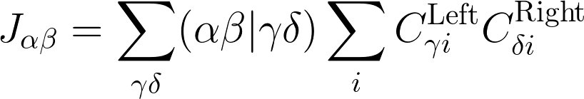
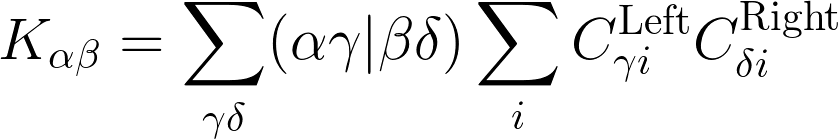

# Using Psi4 as Python Module

Psi4 can be used directly as a Python module `psi4` or 
by running Psi4 executable that reads input file, written
in Psithon: a Python language extended with some additional
features of Psi4. Some of those features are:
 * setting memory
 * setting options
 * setting molecule
 * setting custom basis set 

Inputting in Psi4 is very straightforward, so here we won't focus on
that. Example of input that runs some few jobs
is given below:

```python
# test molecule
molecule h2o {
0 1
O           -1.518433    -0.295769    -0.152840
H           -0.603812    -0.108539    -0.010317
H           -1.941594    -0.190769     0.679492
--
0 1
O            1.444025     0.279898     0.140319
H            1.996747    -0.449883    -0.077824
H            1.729556     1.001082    -0.392639

symmetry c1
units angstrom
no_reorient
no_com
}

set 
{
    # ==> General Psi4 Options <== #
    step_type                     nr
    opt_coordinates               cartesian
    g_convergence                 gau_verytight
    full_hess_every               -1
    geom_maxiter                  50
    intrafrag_step_limit          0.05
    intrafrag_step_limit_max      0.05
    intrafrag_step_limit_min      0.05
    dynamic_level                 0
    basis                         6-31G*
    scf_type                      direct
    guess                         core
    e_convergence                 1e-7
    d_convergence                 1e-8
    print                         1
    puream                        True
    freeze_core                   False
    onepdm                        False
    opdm_relax                    False
    cc_type                       df
    df_basis_scf                  aug-cc-pvdz-jkfit
    df_basis_cc                   aug-cc-pvdz-ri
    df_basis_sapt                 aug-cc-pvdz-ri
}

# run optimization
e, w = optimize('scf', molecule=h2o, return_wfn=True)

# compute interaction energy decomposition
energy('sapt0', molecule=h2o)
```

The above task is a Psithon script that performs geometry optimization
of water dimer in ground state by using the HF/6-31G(d) model. After that,
it decomposes the interaction energy by using the symmetry adapted 
perturbation theory ([SAPT](http://www.psicode.org/psi4manual/master/sapt.html)) method.
To read more about inputting in Psi4, refer to the online 
Psi4 [documentation](http://www.psicode.org/psi4manual/master/index.html).

Below, we shall go through a few technical aspects that we will encounter later on during the workshop.

## Molecule object

It is often useful to extract atomic positions, atomic numbers or masses, or quickly get the center of mass
of the molecule. `psi4.core.Molecule` class contains very handy implementation of the above and much more
functionalities. To specify molecule, we always need to provide charge and multiplicity. Symmetry information
can also be provided. In Psi4, molecular coordinates are usually transformed to some standard orientation
based on symmetry. This can be also switched off (for example, reorientation of molecule and/or translation of the centre of mass).
Let us look at the following example 

```python
inp = ("""
0 1
C
C  1  rcc
H  1  rch  2  ahcc
H  2  rch  1  ahcc  3  d1
H  2  rch  1  ahcc  3  d2
H  1  rch  2  ahcc  5  d1
C  1  ro   2  a1    4  d3
C  7  rcc  1  a1    2  d1
H  7  rch  8  ahcc  2  d3
H  8  rch  7  ahcc  9  d1
H  8  rch  7  ahcc  9  d2
H  7  rch  8  ahcc  11 d1

rcc = 1.33627
rch = 1.08510
ro  = 4.16896
ahcc= 121.693
a1  = 90.0000
d1  = 0.00000
d2  = 180.000
d3  = 89.906

units angstrom
symmetry c1
noreorient
nocom
""")

```
Notice that we can also use z-matrix to define the geometry. The above is the ethylene dimer in D2h symmetry,
but it is still a Python string.
To create a molecule object from it one can for example use `psi.geometry` functionality,

```python
mol = psi4.geometry(inp)
```

The returned object, `mol`, is a `psi.core.Molecule` object.
Altering the molecular geometry is very strightforward, especially when Z-matrix is used. Let us say, we want
to increase the distance between ethylene monomers. To do this, we must just reset an appropriate
attribute defined in the input geometry, i.e.,

```python
mol.ro = 3.4000 # this sets the distance between ethylene monomer atomic planes to 3.4 Angstrom
mol.update_geometry()
```

Getting the coordinates, atomic masses, numbers and computing the center of mass is also very simple,

```python
xyz = mol.geometry()
com = mol.center_of_mass()
for i in range(mol.natom()):
    Z = mol.Z(i)
    x = mol.x(i)
    y = mol.y(i)
    z = mol.z(i)
    print(" Atomic centre N=%3d Z=%3d x=%13.5f y=%13.5f z=%13.5f", i+1, Z, x, y, z)
```

Check by typing `help(psi4.core.Molecule)` in interactive Python about all functionalities.

Before we go to next section, we provide a handy wrapper functon to directly create Molecule
object directly from the XYZ file:

```python
def psi_molecule_from_file(f, frm=None, no_com=True, no_reorient=True):
    "Construct psi4.core.Molecule object from structure file"
    if frm is None: frm = f.split('.')[-1].lower()
    #
    if frm == 'xyz':
       qmol = psi4.qcdb.Molecule.init_with_xyz(f, no_com=no_com, no_reorient=no_reorient)
       mol  = psi4.geometry(qmol.create_psi4_string_from_molecule())
    else: raise ValueError("Unrecognised format - %s -" % frm)
    #
    mol.update_geometry()
    return mol
```
You can upgrade this function by adding more file formats.

## BasisSet object

The Gaussian basis set object is very important functionality, because we shall often
compute various molecular integrals. The `psi.core.BasisSet` class is a powerful tool to create various
basis set objects from molecule specification.

```python
bfs = psi4.core.BasisSet.build(mol, "ORBITAL", psi4.core.get_global_option("BASIS"), puream=1)
```
The above command creates basis set from the Molecule object
by taking the keyword `BASIS` from the psi4 options and 
using the pure angular momentum functions.
BasisSet object can be used also to determine the assignment of each basis function to its atomic nucleus.

> *Excercise*. Write a simple script which prints out all the basis set data: atomic centres,
> orbital exponents and contraction coefficients. Hint: all these information can be directly accessed
> from the BasisSet object.

## Mints: molecular integrals

Once one is familiar with the BasisSet object, the next very useful utility is molecular integral
factory implemented in the `psi4.core.MintsHelper` class. The following code snippet shows some examples:

```python
mints = psi4.core.MintsHelper(bfs)
S = mints.ao_overlap()
T = mints.ao_kinetic()
D = mints.ao_dipole()
eri = mints.ao_eri()
```

What other integrals can you generate using MintsHelper object? What are the types of object returned by
its methods?

> *Excercise*: Compute the eigenvalues of the overlap matrix in AO basis and assess the extent of linear dependencies
> in the basis set used. Compute the AO basis orthogonalizer matrix, that is, the transformation
> matrix from non-orthogonal AO basis to an orthogonal AO basis. You can use the Lowdin symmetric orthogonalization
> method.

## JK object: generalized Coulomb and exchange integrals

Cartain contractions with two-electron integrals are of particular importance in Quantum Chemistry.
Often one might need to compute the following generalized Coulomb and exchange matrices,




where two-electron integral is defined here according to the Coulomb (chemists') notation, 
whereas two **C** matrices (labeled here as left and right) are transformation matrices
from AO basis to some other arbitrary basis (another AO basis, some MO basis, etc).

To build the JK object, one needs the BasisSet object only,
```python
jk = psi4.core.JK.build(bfs, jk_type="Direct")
jk.set_memory(int(5e8))
jk.initialize()
```
Below the code snippet presents the way to compute sets of **J** and **K** matrices
in a parallel and very efficient fashion,

```python
c_set = []
c_set.append(wfn.Ca(), wfn.Ca())
# one can append more sets of right and left C matrices
for cl, cr in c_set:
    jk.C_clear()
    jk.C_left_add(cl)
    jk.C_right_add(cr)
jk.compute()
J_set = jk.J()
K_set = jk.K()

# print K matrix for first set on the screen as NumPy ndarray:
print(K_set[0].to_array())
```
Of course, **J** and **K** matrices can be also computed by other means in Python.
However, the JK object is the fastest way to do that.

> *Excercise*: Compute the **J** and **K** matrices for an SCF closed shell wavefunction
> by using the JK object and by the following alternate method: compute two-repulsion
> integrals by using the MintsHelper utility, and perform tensor contractions,
> e.g., by using the `numpy.einsum` function. Ensure that the results from both calculations
> aggree. Compute the total time for calculation and compare. Which is faster and how much?

## Wavefunction object

Psi4 has a very powerful class `psi4.core.Wavefunction` that handles all sorts of wavefunctions.
The base class, Wavefunction, contains the most useful functionalities, such as obtaining
the Molecule or primary BasisSet objects, getting the reference energy, or even one electron integrals.
In Psi4, it is safer to create them by using the specialized drivers that ensure that wavefunctions
built this way are correct.

## Psi4 drivers: computing wavefunctions and more

Driver `energy` is one of the most important Psi4 drivers, since it has the capability to compute
total energy of the system and return the associated wavefunction. For example,
we can solve the time-independent Schrodinger equation by using various approximate methods,

```python
e_hf, w_hf = psi4.energy('scf', molecule=h2o, return_wfn=True)
e_cc2, w_cc2 = psi4.energy('cc2', molecule=h2o, return_wfn=True, ref_wfn=w_hf)
```

Note that `e_hf` and `e_cc2` are total energies whereas `w_hf` and `w_cc2` are the Wavefunction objects.
We can also
grab some data from those objects:

```python
# Fock matrix (alpha)
Fa = w_hf.Fa()

# AO overlap matrix
S = w_hf.S()

# H-core Hamiltonian matrix
H = w_hf.H()

# molecule object and basis set object
mol = w_hf.molecule()
bfs = w_hf.bassiset()
```

What else can you extract from the wavefunctions returned by Psi4 driver `energy`?
Check out also other Psi4 drivers:
 * `gradient`
 * `optimize`

## Computing the one-particle density matrix

Wavefunction object contains methods to extract the one-particle density matrix, 
which can be very useful in many applications. However, one must be careful about the
level of theory. For HF and FCI, density matrix can be normally extracted,

```python
hf_e, hf_wfn = psi4.energy('scf', molecule=mol, return_wfn=True)
hf_da = hf_wfn.Da()
hf_db = hf_wfn.Db()

fci_e, fci_wfn = psi4.energy('fci', molecule=mol, return_wfn=True)
fci_da = hf_wfn.Da()
fci_db = hf_wfn.Db()
```

However, for other post-HF wavefunction methods such as truncated CI or CC, 
the density matrix is usually not computed directly
when using the `energy` driver. This is because computing the explicit density matrix
(which is costly)
is not necessary to obtain the energy.
Therefore, 

```python
hf_e, cc_wfn = psi4.energy('ccsd', molecule=mol, return_wfn=True)
cc_da = hf_wfn.Da()
```

will yield **SCF density matrices, not CC density matrices**.
In order to compute the density matrix in particular level of post-HF theory, one must run the density calculations.
They are usually undertaken when computing the atomic energy gradients,

```python
cc_gr, cc_wfn = psi4.gradient('ccsd', molecule=mol, return_wfn=True)
cc_da = cc_wfn.Da()
```

## Setting options for Psi4

Note that during each Psi4 run, 
the **singleton** object of type `psi4.core.Options` is created.
This object can be accessed by various means, for example, each Wavefunction
object stores a reference to it and can be returned by invoking `wfn.options()`.
Setting up options in Psithon, the command `set` can be used.
Once working from pure Python, Psi4 options can be set up
by specifying the Python dictionary

```python
# set Psi4 options
psi4.set_options({"scf_type"       : "df"    ,  # Density-fitted SCF
                  "basis"          : "6-31G*",  # Primary basis set
                  "e_convergence"  : 1e-9    ,  # Energy convergence
                  "puream"         : False   ,  # Using Cartesian AO's
                  "print"          : 3       }) # Print more information to output file

# set Psi4 output and run Psi4 quietly
psi4.core.set_output_file('my_output_file.out', True)
```

## Play around in Python

After we are familiar with the most basic functionalities in Psi4,
let us now address a few important technical problems that developer 
will for sure encounter: transformations of 2- and 4-rank tensors.

### 2-index transformation

Matrices are often subject to transformation to another basis. For example,
in post-HF methods, it is usually the case that we transform 2-index tensors
in AO basis (Fock matrices, H-core Hamiltonian, etc) to various MO bases
(occupied alpha, virtual beta, or all MO's). The full transformation can be formally
written as


where, for simplicity, we assumed Einstein summation notation and each
repeated subscript denotes summation over this subscript. Note that cost is
*o^2n^2* where *o* is the number of molecular orbitals (target basis) whereas *n* is the 
number of AO basis functions (starting basis).
The above transformation can be split into 2 consecutive steps:


Note that now total cost of such joint operation is lesser than the full, one-step transformation.
Let us test it in Python. Let's take a look at the below Python functions:

```python
def two_index_transform_full(int_ab, C1, C2):
    int_IJ = numpy.einsum("ab,aI,bJ->IJ", int_ab, C1, C2)
    return int_IJ

def two_index_transform(int_ab, C1, C2):
    int_Ib = numpy.einsum("ab,aI->Ib", int_ab, C1); del int_ab
    int_IJ = numpy.einsum("Ib,bJ->IJ", int_Ib, C2); del int_Ib
    return int_IJ
```

Let us test it now: 

```python
import numpy

# number of basis functions
n = 40
# number of occupied orbitals
o = 5

# generate some random LCAO-MO matrix and ERI's in AO basis
C = numpy.random.random((n, o))
int_ao = numpy.random.random((n,n))

# compare
t1 = time()
int_mo_1 = two_index_transform(int_ao, C, C)
t2 = time()
int_mo_2 = two_index_transform_full(int_ao, C, C)
t3 = time()

# compute times
T1 = t2-t1
T2 = t3-t2

# check if we got the same result
similar = numpy.allclose(int_mo_1, int_mo_2, rtol=1e-09, atol=1e-09)
assert(similar is True), "There is an error in the implementation!"

print(" 2-index transformation: sequential  t = %10.4f" % T1)
print(" 2-index transformation: full        t = %10.4f" % T2)
print(" Sequential method is %4.1f times faster than full method" % (T2/T1))
```

What can you say about the time needed for both schemes 
to perform two-index transformation 
for basis set sizes during typical quantum chemistry calculations?

### 4-index transformation


Note that cost is now
*o^4n^4*, a considerable order of magnitude judging from the typical sizes 
of basis sets. However, analogously as in the case of 2-index transformation,
the four-index transformation can be split into 4 consecutive steps:


Note that now total cost of such joint operation is way much lesser than the full, one-step transformation.

> Implement the 4-index transformation analogously to the above example 

Let us test it and do some comparison!
For setting 40 AO basis functions and only 5 occupied molecular orbitals
the output of our script is
```
 4-index transformation: sequential  t =     0.0111 seconds
 4-index transformation: full        t =    12.7218 seconds
 Sequential method is 1143.0 times faster than full method
```
There is three orders of magnitude difference in these two 4-index transformation
approaches! Note that implementation of it is very simple and quite straightforward, even in Python.

-----------
[Main Page](https://github.com/globulion/qc-workshop)
