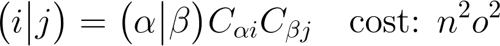
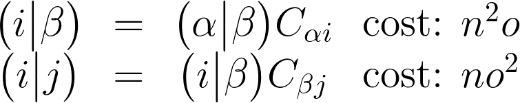
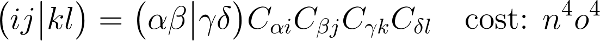
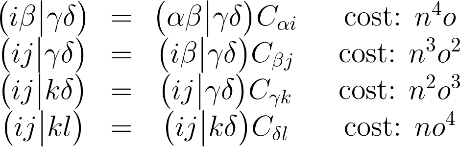

# Using Psi4 as Python Module

Psi4 can be used directly as a Python module `psi4` or 
by running Psi4 executable that reads input file, written
in Psithon: a Python language extended with some additional
features of Psi4. Some of those features are:
 * setting memory
 * setting options
 * setting molecule
 * setting custom basis set 

Inputting in Psi4 is very straightforward, so here we won't focus on
that. Example of input that runs some few jobs
is given below:

```python
# test molecule
molecule h2o {
0 1
O           -1.518433    -0.295769    -0.152840
H           -0.603812    -0.108539    -0.010317
H           -1.941594    -0.190769     0.679492
--
0 1
O            1.444025     0.279898     0.140319
H            1.996747    -0.449883    -0.077824
H            1.729556     1.001082    -0.392639

symmetry c1
units angstrom
no_reorient
no_com
}

set 
{
    # ==> General Psi4 Options <== #
    step_type                     nr
    opt_coordinates               cartesian
    g_convergence                 gau_verytight
    full_hess_every               -1
    geom_maxiter                  50
    intrafrag_step_limit          0.05
    intrafrag_step_limit_max      0.05
    intrafrag_step_limit_min      0.05
    dynamic_level                 0
    basis                         6-31G*
    scf_type                      direct
    guess                         core
    e_convergence                 1e-7
    d_convergence                 1e-8
    print                         1
    puream                        True
    freeze_core                   False
    onepdm                        False
    opdm_relax                    False
    cc_type                       df
    df_basis_scf                  aug-cc-pvdz-jkfit
    df_basis_cc                   aug-cc-pvdz-ri
    df_basis_sapt                 aug-cc-pvdz-ri
}

# run optimization
e, w = optimize('scf', molecule=h2o, return_wfn=True)

# compute interaction energy decomposition
energy('sapt0', molecule=h2o)
```

The above task is a Psithon script that performs geometry optimization
of water dimer in ground state by using the HF/6-31G model. After that,
it decomposes the interaction energy by using the symmetry adapted perturbation theory (SAPT) method.

Below, we shall go through a few technical aspects that we will encounter later on during the workshop.

## Molecule object

## Basis set object

## Mints: molecular integrals

Very useful class is `psi4.core.MintsHelper`. Let us generate some integrals!

```python
mints = psi4.core.MintsHelper(bfs)
S = mints.ao_overlap()
T = mints.ao_kinetic()
D = mints.ao_dipole()
eri = mints.ao_eri()
```

What other integrals can you generate using MintsHelper object? What are the types of object returned by
its methods?

## Psi4 drivers: computing wavefunctions and more

Solve time-independent Schrodinger equation:

```python
e_hf, w_hf = psi4.energy('scf', molecule=h2o, return_wfn=True)
e_cc2, w_cc2 = psi4.energy('cc2', molecule=h2o, return_wfn=True, ref_wfn=w_hf)
```

Grab some data from those objects:

```python
# Fock matrix (alpha)
Fa = w_hf.Fa()

# AO overlap matrix
S = w_hf.S()

# H-core Hamiltonian matrix
H = w_hf.H()

# molecule object and basis set object
mol = w_hf.molecule()
bfs = w_hf.bassiset()
```

What else can you extract from the wavefunctions returned by Psi4 driver `energy`?
Check out also other Psi4 drivers:
 * `gradient`
 * `optimize`


## Play around in Python

Let us address a few important technical problems that developer 
will for sure encounter.

### 2-index transformation

Matrices are often subject to transformation to another basis. For example,
in post-HF methods, it is usually the case that we transform 2-index tensors
in AO basis (Fock matrices, H-core Hamiltonian, etc) to various MO bases
(occupied alpha, virtual beta, or all MO's). The full transformation can be formally
written as



where, for simplicity, we assumed Einstein summation notation and each
repeated subscript denotes summation over this subscript. Note that cost is
*o^2n^2* where *o* is the number of molecular orbitals (target basis) whereas *n* is the 
number of AO basis functions (starting basis).
The above transformation can be split into 2 consecutive steps:



Note that now total cost of such joint operation is lesser than the full, one-step transformation.
Let us test it in Python. Let's take a look at the below Python functions:

```python
def two_index_transform(int_ab, C1, C2):
    int_Ib = numpy.einsum("ab,aI->Ib", int_ab, C1); del int_ab
    int_IJ = numpy.einsum("Ib,bJ->IJ", int_Ib, C2); del int_Ib
    return int_IJ

def two_index_transform_full(int_ab, C1, C2):
    int_IJ = numpy.einsum("ab,aI,bJ->IJ", int_ab, C1, C2)
    return int_IJ
```

Let us test it now: 

```python
import numpy

# number of basis functions
n = 40
# number of occupied orbitals
o = 5

# generate some random LCAO-MO matrix and ERI's in AO basis
C = numpy.random.random((n, o))
int_ao = numpy.random.random((n,n))

# compare
t1 = time()
int_mo_1 = two_index_transform(int_ao, C, C)
t2 = time()
int_mo_2 = two_index_transform_full(int_ao, C, C)
t3 = time()

# compute times
T1 = t2-t1
T2 = t3-t2

# check if we got the same result
similar = numpy.allclose(int_mo_1, int_mo_2, rtol=1e-09, atol=1e-09)
assert(similar is True), "There is an error in the implementation!"

print(" 2-index transformation: sequential  t = %10.4f" % T1)
print(" 2-index transformation: full        t = %10.4f" % T2)
print(" Sequential method is %4.1f times faster than full method" % (T2/T1))
```

What can you say about the time needed for both schemes 
to perform two-index transformation 
for basis set sizes during typical quantum chemistry calculations?

### 4-index transformation



Note that cost is now
*o^4n^4*, a considerable order of magnitude judging from the typical sizes 
of basis sets. However, analogously as in the case of 2-index transformation,
the four-index transformation can be split into 4 consecutive steps:



Note that now total cost of such joint operation is way much lesser than the full, one-step transformation.

> Implement the 4-index transformation analogously to the above example 

Let us test it and do some comparison!
For setting 40 AO basis functions and only 5 occupied molecular orbitals
the output of our script is
```
 4-index transformation: sequential  t =     0.0111 seconds
 4-index transformation: full        t =    12.7218 seconds
 Sequential method is 1143.0 times faster than full method
```
There is three orders of magnitude difference in these two 4-index transformation
approaches! Note that implementation of it is very simple and quite straightforward, even in Python.

-----------
[Main Page](https://github.com/globulion/qc-workshop)
